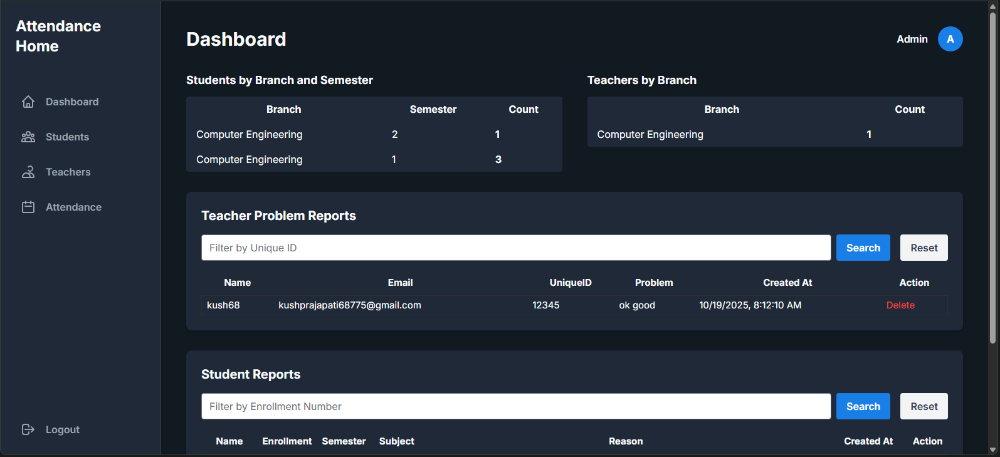
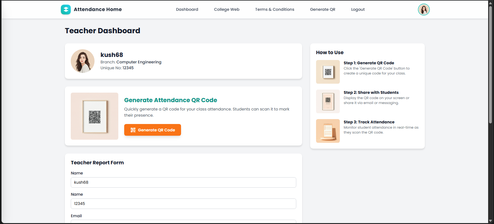
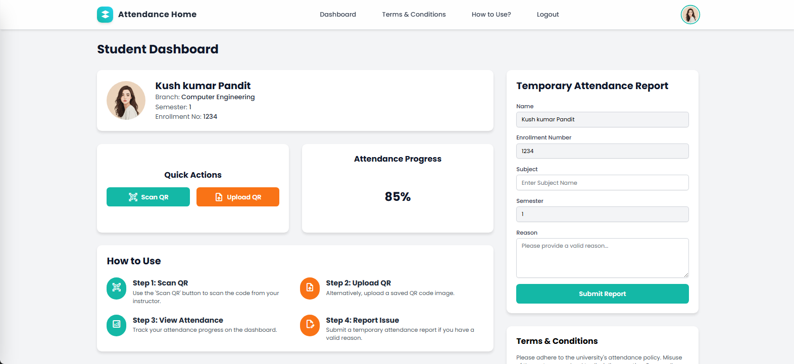

# 🎓 attendence-home

**Modern QR-Powered Attendance Management System**  
_For Government Polytechnic Bhuj — also customizable for any educational or organisational setting_

---





---

## 🚀 Overview

**attendence-home** is a robust, full-stack attendance solution designed to streamline and digitally secure attendance workflows at educational institutions. With role-based web apps for students, teachers, and admins, the project builds a **QR-scanning, token-secured, real-time attendance management system**.

Developed and deployed at Government Polytechnic Bhuj, but openly adaptable by anyone!

---

## ✨ Features

- **Role-Based Access:**  
  - **Student:** Scan QR to mark attendance, submit reports if any problems arise (including temp/manual attendance if system fails).
  - **Teacher:** Generate and display real-time, unique QR codes for the class. Submit issue/feedback reports.
  - **Admin:**  
    - View/manage all students & teachers  
    - Edit, create, remove students/teachers  
    - Detailed analytics: student branch/semester stats, teacher branch stats  
    - Review and delete all submitted problem/attendance reports  
    - Secure command-line admin creation

- **Authentication & Security:**  
  - JWT-protected APIs and pages  
  - Email/password login & OTP verification (NodeMailer)
  - [bcryptjs] password hashing  
  - Robust role separation (middleware for roles, admin, tokens)

- **QR Code Attendance:**  
  - Teachers generate QR (using `qrcode` lib); students scan and upload (via `@zxing/browser`, `@yudiel/react-qr-scanner`, etc.)
  - Prevents duplicate/ghost attendance  
  - IP logging, expiry for scan

- **Modern UI:**  
  - Built in React (Vite) with TailwindCSS  
  - Fully responsive and smooth, with themed dashboards

- **Reports & Issue Management:**  
  - Both students and teachers can submit feedback/attendance issues  
  - Admin can filter/search/delete reports easily

---

## 🏗️ Folder Structure

attendence-home/
│ package.json
│ ...
├── backend/
│ ├── authentication/
│ ├── connection/
│ ├── controller/
│ ├── middleware/
│ ├── model/
│ └── routes/
├── design/
│ └── *.html # Additional static/legacy HTML forms
└── frontend/
├── public/
└── src/
├── admin/ # Admin-facing pages & components
├── apis/ # Axios-based API wrappers
├── components/ # Shared UI, QR, forms
├── context/ # Auth context (JWT flow)
├── pages/ # All dashboards, login/signup
└── styles/ # Custom CSS for forms/dashboards


---

## 🛠️ Tech Stack

- **Frontend:**  
  - React 19 + Vite + TailwindCSS  
  - QR Scanning: `@zxing/browser`, `@yudiel/react-qr-scanner`, `react-qr-barcode-scanner`  
  - Routing: `react-router-dom`, Context API, Axios

- **Backend:**  
  - Express 5, Node.js  
  - JWT (`jsonwebtoken`), bcryptjs, Helmet, CORS  
  - Email/OTP: `nodemailer`  
  - Database: MongoDB/Mongoose
  - Rate Limiting, Middleware Security
  - QR Code Gen: `qrcode`

---

## 🖥️ Screenshots

| Admin Dashboard           | Teacher Dashboard          | Student Dashboard         |
|---------------------------|---------------------------|--------------------------|
|  |  |  |

---

## ✅ Installation & Setup

1. **Clone the repository:**

git clone https://github.com/Kushdeveloper68/attendence-home.git
cd attendence-home

2. **Backend setup:**

cd backend
npm install


- Create a `.env` file in `/backend`:

  ```
  EMAIL=your_gmail_here@gmail.com
  PASS=your_app_password_or_smtp_pass
  SECRETJSONKEY=your_secret_key_here
  MONGO_URI=your_mongodb_atlas_or_local_url
  ```

- Start backend server:

  ```
  npm start
  ```

3. **Frontend setup:**

cd ../frontend
npm install
npm run system
Or: npm run dev (if using standard Vite config)


4. **First Admin Setup:**

- To create your first admin:
  ```
  node backend/controller/admincreation.js
  ```
- Login at `/admin` with the credentials you set up.

---

## 👩‍💻 Roles & Flows

| Role    | Abilities                                                 |
|---------|-----------------------------------------------------------|
| Student | - Mark attendance by scanning QR<br>- Report issues<br>- Temp self-attendance if needed |
| Teacher | - Generate/show QR<br>- See class reports<br>- Report issues |
| Admin   | - All CRUD on students/teachers<br>- Detailed stats<br>- See & delete all reports |

- **Single role per user per email**
- **JWT authentication across all sessions**
- **Admin is created via backend command**

---

## ⚡ Use Cases

- Real-time, fraud-proof attendance in classrooms or events.
- Automated student/teacher management.
- One-click reporting system for tech/admin problems.
- Universally extensible for any school, college, or organization.

---

## ✏️ Customization

- Change logo/branding in `/frontend/public` and `/frontend/src/assets`
- Edit institution-specific details in landing/login UI.

---

## 📫 Contributing

Open for improvements!  
**Want to add features, fix bugs, or white-label for your organization?**  
Please [open an issue](https://github.com/Kushdeveloper68/attendence-home/issues) or contact me at [kushpandit68775@gmail.com](mailto:kushpandit68775@gmail.com) for access.

---
##Help

If you are facing any problem to deploy or maanage this project in your system. contact me: <a href="mailto:kushpandit68775@gmail.com">Email...<a>


## 📝 License

MIT (2025) Kush Pandit.
Free to use, fork, and modify for non-commercial academic/personal projects.

---

> Made with ❤️ for education and tech-driven transparency.

